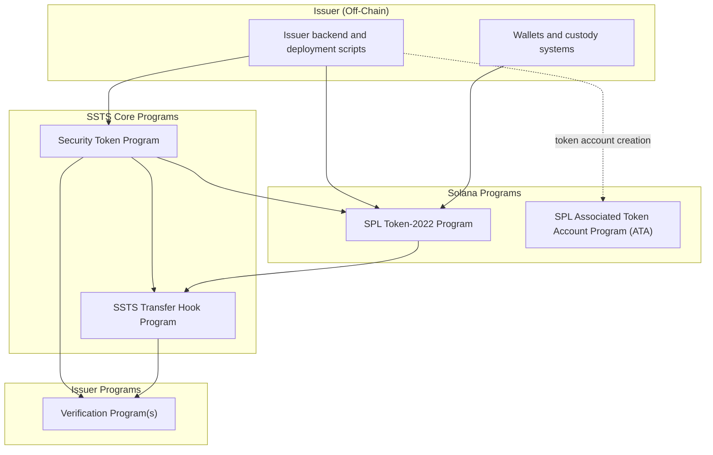
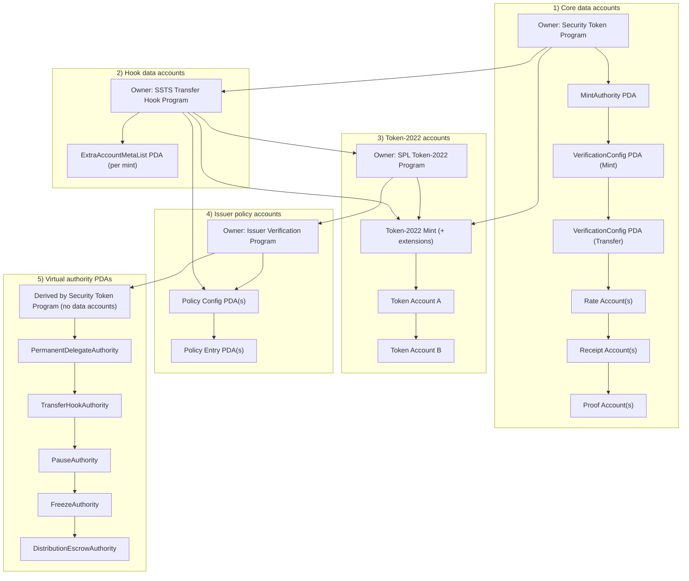
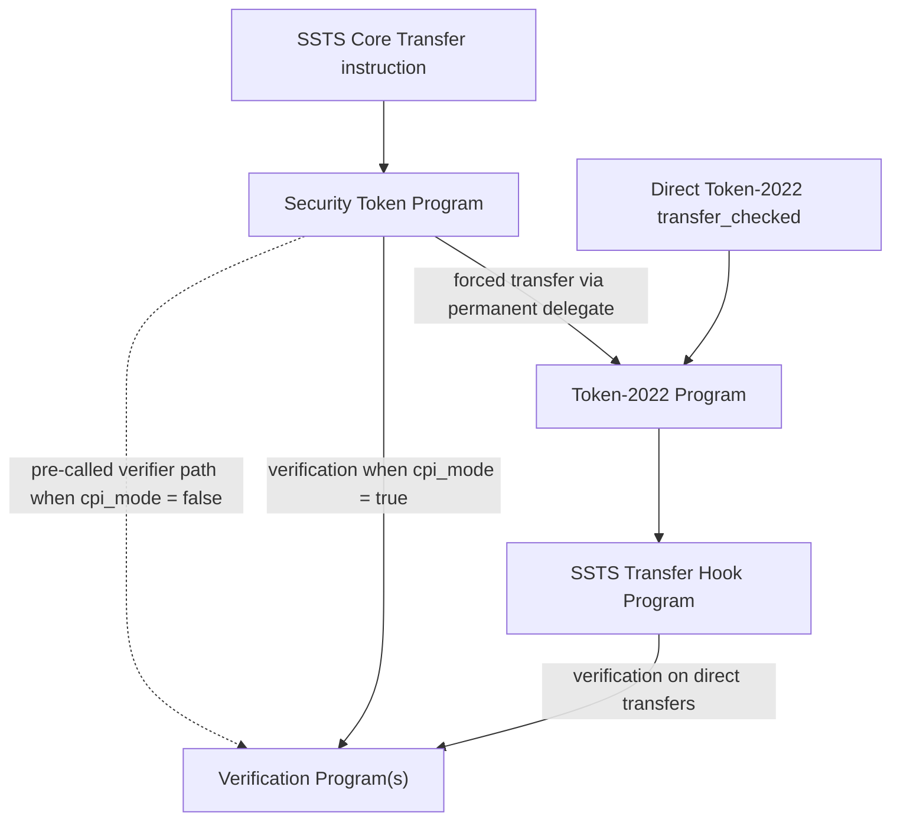

SSTS architecture has clear boundaries between standard Solana programs, foundation-managed core deployments, and issuer policy deployments.

## 1) Deployment boundaries

`ATA` is the SPL Associated Token Account program. It is the standard program used to derive and create canonical token accounts for a wallet + mint pair.

## 2) On-chain account topology (per mint)

## 3) Transfer enforcement entry points

## Ownership and responsibility summary

| Category | Component examples | Deployed and managed by |
| --- | --- | --- |
| Standard Solana / SPL | `Token-2022`, `Associated Token Account Program (ATA)` | Solana / SPL ecosystem |
| SSTS core | `Security Token Program`, `SSTS Transfer Hook Program` | SSTS Foundation |
| Issuer policy | verification program(s) and their policy PDAs | issuer / integrator teams |

## Why these diagrams

- Diagram 1 answers deployment and trust boundaries.
- Diagram 2 answers which accounts exist and which program owns them.
- Diagram 3 answers where transfer policy is enforced for both transfer entry paths.

For instruction-level account order, discriminators, and authorization rules, see [Verification model](/docs/verification-model) and [All Instructions](/docs/api-security-token-program).
