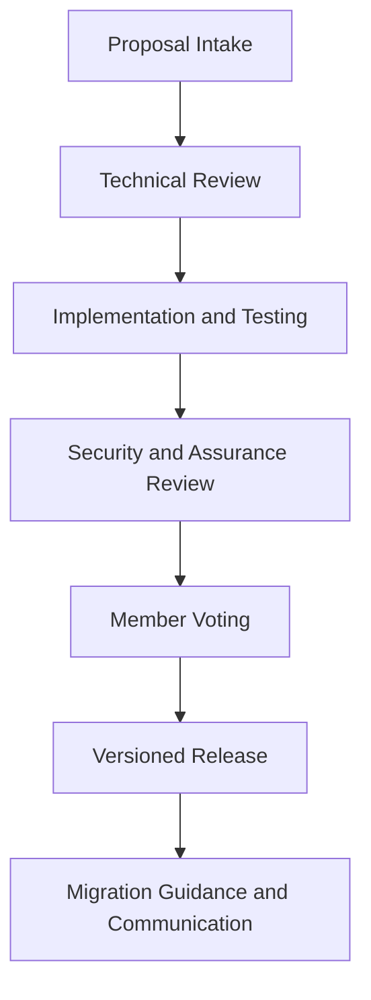

SSTS core contracts are stewarded by the SSTS Foundation, an independent nonprofit standards organization with participation from leading industry and ecosystem members.

For users of the standard, this means the core is managed as shared infrastructure for the ecosystem, not as a single-issuer codebase.

## Governance process

## Governance principles

- Neutrality: changes are evaluated for ecosystem-wide utility, not one-party advantage.
- Transparency: versioning, release notes, and roadmap are published.
- Reliability: upgrades follow a staged process with technical and operational checks.
- Auditability: consistent interfaces and behavior across versions.


The foundation manages core lifecycle for the common good: standard evolution, quality gates, and coordinated releases. Integrators focus on configuration and policy modules, not managing core contract deployment.


## What integrators should expect

- stable, published program IDs per network
- explicit versioned releases
- advance notice for behavior changes and deprecations
- migration documentation for adoption planning

## Your scope as a standard user

- integrate against foundation-published core programs
- configure verification logic and issuer workflows
- maintain verifier programs when your policy model requires custom controls
