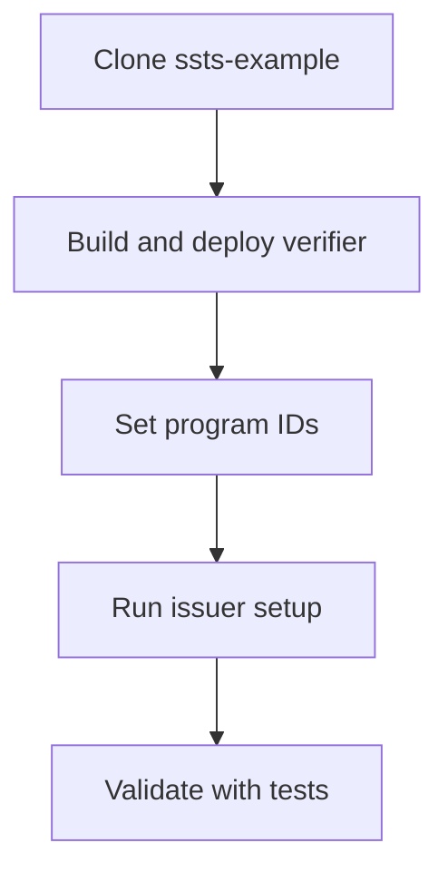

Use the issuer reference implementation as your starting skeleton:

- [https://github.com/Solana-Security-Token-Standard/ssts-example](https://github.com/Solana-Security-Token-Standard/ssts-example)

The implementation example includes a very lightweight whitelist verification program that could be used as a basis for a full KYC implementation. The program only allows transfers to addresses that have been previously whitelisted by the program admin.


This flow assumes SSTS core programs are already deployed and managed by the SSTS Foundation for your target network.


## What you get in the skeleton

- `scripts/issuer-setup.ts`: issuer-side setup and token initialization flow
- `verification-programs/transfer-whitelist`: lightweight verifier example
- `tests/e2e`: chain-state tests for introspection/CPI transfer scenarios

The bundled whitelist verifier is intentionally minimal. It is a good base to extend with your own policy checks.

## End-to-end flow



## 1) Clone and prepare

```bash
git clone https://github.com/Solana-Security-Token-Standard/ssts-example.git
cd ssts-example
npm install
cp .env.example .env
```

## 2) Build and deploy your verification program

```bash
CLUSTER=devnet npm run build
CLUSTER=devnet npm run deploy:verification
```

By default, this builds and deploys the lightweight transfer whitelist verifier from `verification-programs/transfer-whitelist`.

## 3) Configure program IDs

Update `config/program-ids.json` for your target cluster:

- `securityTokenProgram`: foundation-published core program ID
- `transferHookProgram`: foundation-published hook program ID
- `transferWhitelistProgram`: your deployed verifier program ID

Minimal shape:

```json
{
  "devnet": {
    "securityTokenProgram": "SSTS...",
    "transferHookProgram": "Hook...",
    "transferWhitelistProgram": "YourVerifier..."
  }
}
```

## 4) Run issuer setup

```bash
CLUSTER=devnet npm run issuer:setup

# Call help for more options:
npm run issuer:setup -- --help
```

This configures mint and transfer verification and writes a setup artifact to `config/issuer-state-devnet.json` (or `config/issuer-state-<cluster>.json`).

## 5) Validate behavior

```bash
CLUSTER=devnet npm run test:e2e
```