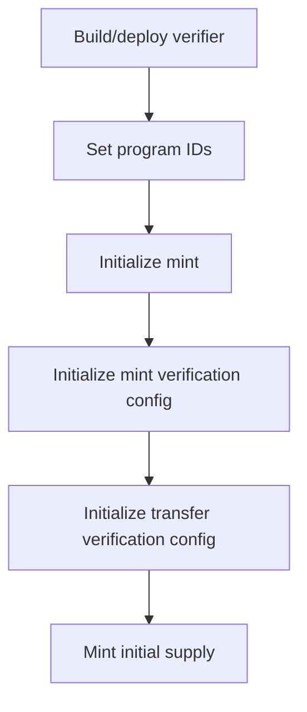

This page shows the minimal script flow to:

1. deploy a verifier program
2. register that verifier in SSTS verification config
3. issue a token with that verification config

Reference implementation source: `ssts-example/scripts/issuer-setup.ts`.

## Flow



## 1) Deploy verifier program

```bash
CLUSTER=devnet npm run build
CLUSTER=devnet npm run deploy:verification
```

Then put the deployed verifier ID in `config/program-ids.json` for your cluster.

## 2) Minimal program-id config

Use the core ID registry in this docs repo as the source of truth:



In the issuer repo (`ssts-example`), set `config/program-ids.json` by adding your verifier program ID for the same cluster:

```json
{
  "devnet": {
    "securityTokenProgram": "<core security token program id>",
    "transferHookProgram": "<core transfer hook program id>",
    "transferWhitelistProgram": "<your deployed verifier program id>"
  }
}
```

## 3) Minimal TypeScript setup flow

This is a trimmed example to show required instruction sequence. For exact module-loading helpers, mirror `scripts/issuer-setup.ts`.

```ts
import {
  AccountRole,
  address,
  appendTransactionMessageInstructions,
  createSolanaRpc,
  createTransactionMessage,
  sendTransactionWithoutConfirmingFactory,
  setTransactionMessageFeePayerSigner,
  setTransactionMessageLifetimeUsingBlockhash,
  signTransactionMessageWithSigners,
} from "@solana/kit"
import fs from "node:fs"
import path from "node:path"

import {
  getInitializeMintInstruction,
} from "../clients/typescript/src/generated/instructions/initializeMint"
import {
  getInitializeVerificationConfigInstruction,
} from "../clients/typescript/src/generated/instructions/initializeVerificationConfig"
import {
  getMintInstruction,
} from "../clients/typescript/src/generated/instructions/mint"

const INSTRUCTION_DISCRIMINATORS = { mint: 6, transfer: 12 } as const
const INSTRUCTIONS_SYSVAR = address("Sysvar1nstructions1111111111111111111111111")
const TOKEN_2022_PROGRAM = address("TokenzQdBNbLqP5VEhdkAS6EPFLC1PHnBqCXEpPxuEb")

type Cluster = "localnet" | "devnet" | "testnet" | "mainnet"
type ProgramIds = {
  securityTokenProgram: string | null
  transferHookProgram: string | null
  transferWhitelistProgram: string | null
}

const cluster = (process.env.CLUSTER ?? "devnet") as Cluster
const configPath = path.resolve("config/program-ids.json")
const allProgramIds = JSON.parse(
  fs.readFileSync(configPath, "utf8"),
) as Record<Cluster, ProgramIds>
const programIds = allProgramIds[cluster]

if (
  !programIds?.securityTokenProgram ||
  !programIds.transferHookProgram ||
  !programIds.transferWhitelistProgram
) {
  throw new Error(`Missing one or more program IDs for ${cluster} in ${configPath}`)
}

const securityTokenProgramId = address(programIds.securityTokenProgram)
const transferHookProgramId = address(programIds.transferHookProgram)
const verifierProgramId = address(programIds.transferWhitelistProgram)

// Inputs: payer signer, mint signer, and required PDAs.
// PDA derivation is the same as in scripts/issuer-setup.ts.

const initMintIx = getInitializeMintInstruction(
  {
    mint: mintSigner,
    authority: mintAuthorityPda,
    payer: payerSigner,
    initializeMintArgs: {
      ixMint: {
        decimals: 6,
        mintAuthority: payerSigner.address,
        freezeAuthority: freezeAuthorityPda,
      },
      ixMetadataPointer: {
        authority: payerSigner.address,
        metadataAddress: mintSigner.address,
      },
      ixMetadata: {
        name: "Example Security Token",
        symbol: "EXMPL",
        uri: "",
        additionalMetadata: new Uint8Array(),
      },
      ixScaledUiAmount: null,
    },
  },
  { programAddress: securityTokenProgramId },
)

const initMintConfigIx = getInitializeVerificationConfigInstruction(
  {
    mint: mintSigner.address,
    verificationConfigOrMintAuthority: mintAuthorityPda,
    instructionsSysvarOrCreator: payerSigner.address,
    payer: payerSigner,
    mintAccount: mintSigner.address,
    configAccount: verificationConfigMintPda,
    systemProgram: address("11111111111111111111111111111111"),
    accountMetasPda,
    transferHookPda,
    transferHookProgram: transferHookProgramId,
    initializeVerificationConfigArgs: {
      instructionDiscriminator: INSTRUCTION_DISCRIMINATORS.mint,
      cpiMode: true,
      programAddresses: [verifierProgramId],
    },
  },
  { programAddress: securityTokenProgramId },
)

const initTransferConfigIx = getInitializeVerificationConfigInstruction(
  {
    mint: mintSigner.address,
    verificationConfigOrMintAuthority: mintAuthorityPda,
    instructionsSysvarOrCreator: payerSigner.address,
    payer: payerSigner,
    mintAccount: mintSigner.address,
    configAccount: verificationConfigTransferPda,
    systemProgram: address("11111111111111111111111111111111"),
    accountMetasPda,
    transferHookPda,
    transferHookProgram: transferHookProgramId,
    initializeVerificationConfigArgs: {
      instructionDiscriminator: INSTRUCTION_DISCRIMINATORS.transfer,
      cpiMode: false, // introspection mode
      programAddresses: [verifierProgramId],
    },
  },
  { programAddress: securityTokenProgramId },
)

const mintIx = getMintInstruction(
  {
    mint: mintSigner.address,
    verificationConfig: verificationConfigMintPda,
    instructionsSysvar: INSTRUCTIONS_SYSVAR,
    mintAuthority: mintAuthorityPda,
    mintAccount: mintSigner.address,
    destination: recipientAta,
    tokenProgram: TOKEN_2022_PROGRAM,
    amount: 1_000n,
  },
  { programAddress: securityTokenProgramId },
)

const mintWithVerifierIx = {
  ...mintIx,
  accounts: [
    ...(mintIx.accounts ?? []),
    { address: verifierProgramId, role: AccountRole.READONLY },
  ],
}

const rpc = createSolanaRpc("https://api.devnet.solana.com")
const send = sendTransactionWithoutConfirmingFactory({ rpc })

for (const instruction of [initMintIx, initMintConfigIx, initTransferConfigIx, mintWithVerifierIx]) {
  const { value: latestBlockhash } = await rpc.getLatestBlockhash({ commitment: "confirmed" }).send()
  const message = appendTransactionMessageInstructions(
    [instruction],
    setTransactionMessageLifetimeUsingBlockhash(
      latestBlockhash,
      setTransactionMessageFeePayerSigner(payerSigner, createTransactionMessage({ version: "legacy" })),
    ),
  )
  const signed = await signTransactionMessageWithSigners(message)
  await send(signed, { commitment: "confirmed" })
}
```

## 4) Use the full reference script for production

The snippet above is intentionally minimal. For production usage, start from `scripts/issuer-setup.ts` in `ssts-example` because it already handles:

- program account validation
- idempotent reruns
- airdrop/setup conveniences for devnet/localnet
- setup artifact output (`config/issuer-state-<cluster>.json`)
