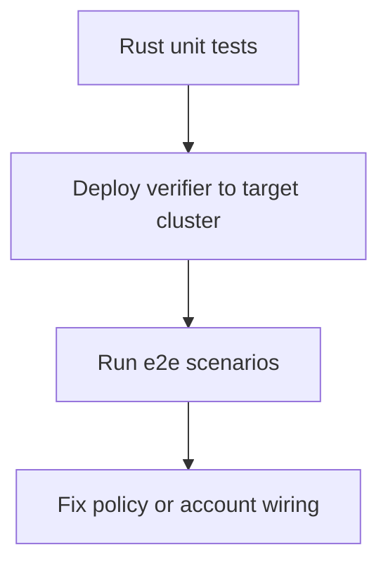

Test in two layers:

- fast local unit tests for verifier logic
- cluster-backed e2e tests for instruction/account wiring

## Test flow



## 1) Run unit tests first

In `ssts-example`, run:

```bash
npm run test:unit
```

This runs Rust tests for programs in `verification-programs/*` (with `--features no-entrypoint`) plus non-e2e TypeScript tests.

## 2) Run e2e tests against deployed programs

Make sure `config/program-ids.json` is set for your cluster, then run:

```bash
CLUSTER=devnet npm run test:e2e
```

The e2e suite in `tests/e2e` verifies:

- introspection transfer behavior
- CPI transfer behavior
- whitelist add/remove effects
- malformed/missing verification context failures

## 3) Minimal introspection-mode test pattern

```ts
const scenario = await createScenario("introspection")
await addWhitelistEntry(scenario, scenario.ataB)

await sendTx(scenario.connection, scenario.payer, [
  buildIntrospectionVerificationIx(scenario),
  buildSstsTransferIx(scenario),
])
```

The verifier instruction must be present before the SSTS transfer instruction in the same transaction.

## 4) Minimal CPI-mode test pattern

```ts
const scenario = await createScenario("cpi")
await addWhitelistEntry(scenario, scenario.ataB)

await assertFails(async () => {
  await sendTx(scenario.connection, scenario.payer, [buildSstsTransferIx(scenario)])
}, "Transfer should fail when CPI verifier context is missing")
```

In CPI mode, required verifier context accounts must be attached to the transfer instruction itself.
