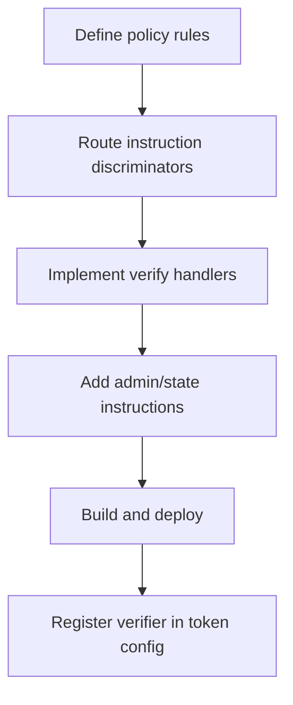

Use the core example as the baseline implementation pattern: [verification-program-example](https://github.com/Solana-Security-Token-Standard/solana-security-token-standard/tree/main/examples/verification-program-example)
We use the reference implementation whitelist verification program as an example here: [transfer-whitelist](https://github.com/Solana-Security-Token-Standard/ssts-example/tree/main/verification-programs/transfer-whitelist)


## Development flow



## 1) Start with discriminator routing

Your verifier receives the operation discriminator in `instruction_data[0]`. Route each operation to a dedicated handler.

```rust
const MINT_DISCRIMINATOR: u8 = 6;
const TRANSFER_DISCRIMINATOR: u8 = 12;

const INIT_DISCRIMINATOR: u8 = 200;
const ADD_DISCRIMINATOR: u8 = 201;
const REMOVE_DISCRIMINATOR: u8 = 202;

pub fn process_instruction(
    program_id: &Pubkey,
    accounts: &[AccountInfo],
    instruction_data: &[u8],
) -> ProgramResult {
    let discriminator = *instruction_data
        .first()
        .ok_or(ProgramError::InvalidInstructionData)?;

    match discriminator {
        INIT_DISCRIMINATOR => initialize_config(program_id, accounts),
        ADD_DISCRIMINATOR => add_to_whitelist(program_id, accounts),
        REMOVE_DISCRIMINATOR => remove_from_whitelist(program_id, accounts),
        MINT_DISCRIMINATOR => Ok(()),
        TRANSFER_DISCRIMINATOR => verify_transfer(program_id, accounts),
        _ => Err(ProgramError::InvalidInstructionData),
    }
}
```

## 2) Implement transfer checks and fail closed

Use transfer verification (`12`) for your policy logic. Reject if required context is missing or malformed.

```rust
fn verify_transfer(program_id: &Pubkey, accounts: &[AccountInfo]) -> ProgramResult {
    if accounts.len() < 4 {
        return Err(ProgramError::NotEnoughAccountKeys);
    }

    // Resolve policy context (PDAs/config/accounts) and validate:
    // - ownership
    // - seeds
    // - active policy state
    // Return ProgramError on any mismatch.

    Ok(())
}
```

The whitelist example supports both introspection and CPI transfer contexts by validating context accounts from PDAs instead of relying on one fixed account position.

## 3) Add admin instructions for policy state

For most real policies, add custom instructions to maintain policy state (for example, allowlist entries, limit tables, jurisdiction configs).

In the whitelist example:

- `200`: initialize config PDA
- `201`: add whitelist entry PDA
- `202`: remove whitelist entry (deactivate)

## 4) Build and deploy from the issuer repo

Place your verifier under `verification-programs/<your-program>` in `ssts-example`, then run:

```bash
CLUSTER=devnet npm run build
CLUSTER=devnet npm run deploy:verification
```

After deployment, put the deployed verifier ID into `config/program-ids.json` as `transferWhitelistProgram` (or equivalent key you use in your setup flow).
