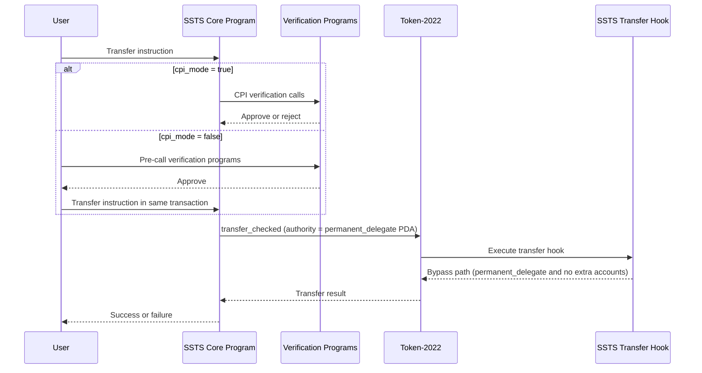
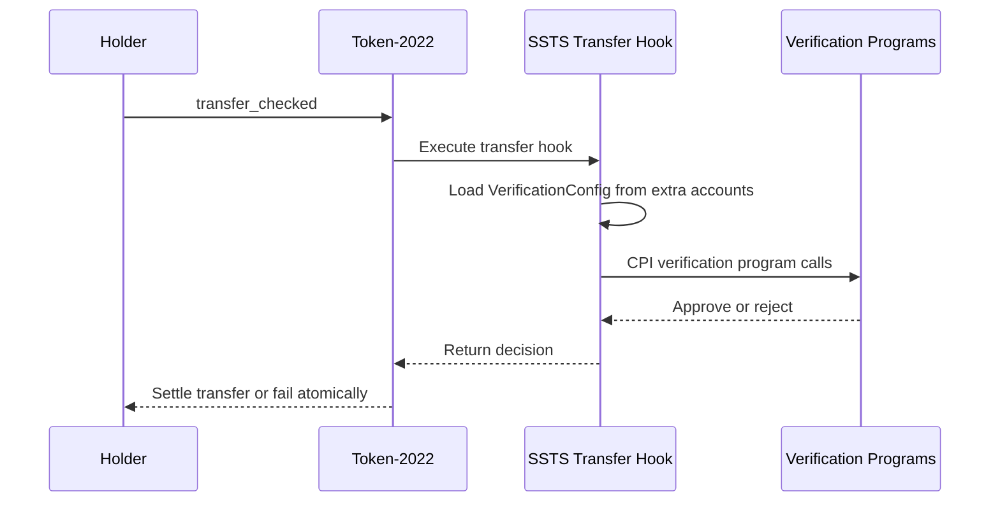

SSTS verification is defined by two dimensions:

1. authorization profile
2. verification execution mode

## Authorization profiles

| Profile | Meaning | Typical instructions |
| --- | --- | --- |
| Permissionless | No external authorization required | `InitializeMint`, `Verify` |
| Initial mint authority OR verification programs | Either creator signature (`MintAuthority`) or verifier approval | metadata/config/rate/distribution admin instructions |
| Verification programs only | Must pass configured verifier checks | `Mint`, `Burn`, `Pause`, `Resume`, `Freeze`, `Thaw`, `Transfer`, `Split`, `Convert`, proof and claim instructions |

## Verification execution modes

### Introspection mode (`cpi_mode = false`)

- Verifier instructions run before the core instruction in the same transaction.
- Core checks the instructions sysvar and validates expected verifier calls.
- Verifier calls must match instruction data and account context requirements.

### CPI mode (`cpi_mode = true`)

- Core invokes each configured verification program directly during execution.
- Verification program accounts are appended at the end of the core instruction account list.
- Core strips verification overhead accounts before verifier CPI so verifiers receive consistent core context.

## Forced transfer path (core `Transfer` instruction)

## Direct wallet transfer path (Token-2022)

## Verification overhead accounts

When an instruction uses verification-program authorization, the first three accounts are:

1. `mint`
2. `verification_config`
3. `instructions_sysvar` (introspection) or CPI placeholder

When the initial-mint-authority authorization path is used, the first three accounts are:

1. `mint`
2. `mint_authority`
3. `creator` signer

For complete account layouts and discriminators, see [All Instructions](/docs/api-security-token-program).
